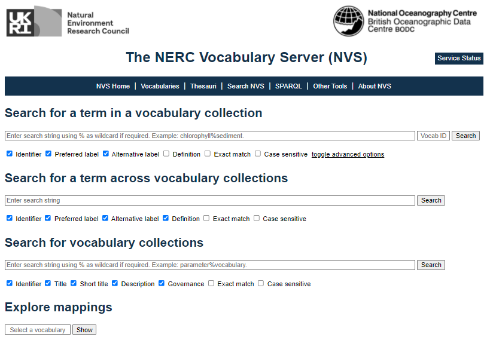

# Searching NERC Vocabulary Server (NVS)
**From the NERC Vocabulary Server [website](https://vocab.nerc.ac.uk/):** The NVS gives access to standardised and 
hierarchically-organized vocabularies. It is managed by the British Oceanographic Data Centre at the National 
Oceanography Centre (NOC) in Liverpool and Southampton, and receives funding from the Natural Environment Research 
Council (NERC) in the United Kingdom. Major technical developments have also been funded by European Union's projects 
notably the Open Service Network for Marine Environmental Data 
([NETMAR](https://www.nersc.no/project/netmar#:~:text=NETMAR%20aims%20to%20develop%20a,from%20ocean%20and%20coastal%20areas.)) 
programme, and the [SeaDataNet and SeaDataCloud](https://www.seadatanet.org/) projects.

Controlled vocabularies are used by data creators and data managers to standardise information. They are used for 
indexing and annotating data and associated information (metadata) in database and data files. They facilitate searching 
for data in web portals. They also enable records to be interpreted by computers. This opens up data sets to a whole 
world of possibilities for automated data workflows, computer aided manipulation, distribution, interoperability, and 
long-term reuse.

The current content of the NVS is predominantly targeted at the oceanographic and associated domains. It is used by the 
marine science community in the UK ([MEDIN](https://www.medin.org.uk/)), Europe 
([SeaDataNet](https://www.seadatanet.org/)), and globally, by a variety of organisations and networks.

## Using the NVS Vocab Search
The NERC vocabulary server can be found at [https://vocab.nerc.ac.uk/search_nvs/](https://vocab.nerc.ac.uk/search_nvs/).

---
# Using GBIF Validator

Once you've determined that there are no crazy outliers or flags raised with your dataset, and your dataset has been 
standardized to the DwC-A format, you can run the [GBIF Data Validator](https://www.gbif.org/tools/data-validator). By 
submitting a dataset to the validator tool, you can go through the validation and interpretation procedures and 
determine potential issues with the standardized data without having to publish it. The following files can be dropped 
or uploaded to the validator tool:

1. ZIP-compressed DwC-A (containing an Occurrence, Taxon or Event Core)
2. IPT Excel templates containing Checklist, Occurrence, or Sampling-event data
3. CSV files containing Darwin Core terms in the first _row_. 

The validation tool provides an indication of whether the dataset can be indexed by GBIF and OBIS or not, and provides 
a summary of issues found during interpretation of the dataset. The main advantage is that you don't have to publish 
your data through the IPT (and hence make it publicly visible) prior to determining any issues related to the data or 
metadata. You will be able to view the metadata as a draft version of the dataset page as it would appear when the 
dataset is published and registered with GBIF. It is typically the final step to be done prior to going through the IPT 
and publish your dataset. 

::::::::::::::::::::::::::::::::: challenge

## Example : Using the GBIF DwC Validator

The GBIF data validator can be used to check a DwC archive `.zip`. 
The validator will highlight issues with the archive like bad rows, missing columns, and much more.

You can try using the validator with 
[this example DwC `.zip` file](../episodes/data/dwca-sfmbon_zooplankton-v1.4-borked.zip) and see the issues with it.

::::::::::::::::: solution

## Solution

The following are issues with the provided DwC archive reported by the GBIF validator (as of 2022-01):

1. Country derived from coordinates
2. Taxon match fuzzy
3. Taxon match higherrank
4. Taxon match none
5. Basis of record invalid
6. Coordinate rounded
7. Geodetic datum assumed WGS84

::::::::::::::::::::::::::

:::::::::::::::::::::::::::::::::::::::::::

If you are at this stage with your own DwC-standardized dataset, run the GBIF validation tool to determine if there are 
any issues with your dataset!
